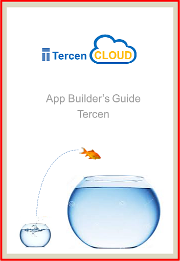

```{r setup, include=FALSE}
knitr::opts_chunk$set(echo = FALSE)
```

# Part 1

## Welcome, blast off at 11:00
<center></center>


<center>workshop on github </center>

<center>(https://github.com/tercen/user_workshop)</center>

## Agenda
- concepts (e.g tables, relational algebra)
- github (e.g. github/tercen, app-library)
- dev environment setup (RStudio, Tercen)

## Why we started Tercen

- the story


## Bioinformatician's Challenges

* Validate methodologies
* Improve analysis quality
* Educate biologists on statistical techniques
* Reduce time spent on IT support
* Change the culture

<center></center>

## Tools evolution

* Calculators, log tables (_homo homini_)
* Excel and Graphpad (_homo australopithecus e.g. Lucy_)
* Tercen (_homo habilis_)
* Unknown (_homo sapien_)
<center></center>
## Thus....

<center></center>
<center></center>

## Features

* Store
* Compute
* Visualize

<center></center>


## Concepts and terms

- measurement (e.g. gene expression value)
- variable (e.g. gene)
- observation (e.g. samples )
- annotation (e.g. of genes or sample)

<center>all are factors!!!</center>

## Wide format

```{r results = 'asis'}
data <- read.delim2(file = file.path("..", "data","genes_wide.tsv")) 
knitr::kable(data[, 1:3], align = "lll")
```

## Long format

```{r results = 'asis'}
data <- read.delim2(file = file.path("..", "data","genes_long.tsv")) 
knitr::kable(data[1:6,], align = "lll")
``` 

## Computed table

After a mean operator of all genes per sample:

```{r results = 'asis'}
data <- read.delim2(file = file.path("..", "data","genes_mean.tsv")) 
knitr::kable(data[1:2,], align = "lll")
``` 

## Relational algebra
- how to define a relation between two Tables
- operators create new Tables (but also relations)
- relations between tables
- more info (https://en.wikipedia.org/wiki/Relational_algebra)
- be careful of vocabulary

## Operator
- Table in (it is a relation)
- operator computes on the Table in
- Table out (and a relation)

## Wrangling

- visual wrangling
- data wrangling
- computational wrangling

```{r echo = FALSE}

pie(c(80,20), labels=c("Wrangle", "Compute"), main="Where is time spent?", col=c("orange","green"), border="white", clockwise=FALSE)

```

## Let's start

- does everyone have the chrome browser installed?
- how many have a laptop with Windows?
- how many have a laptop with Linux?
- how many have a Mac?
- how many do not have a laptop?
- how many have excel, or libreoffice?

## Programming language

- R, R package
- Python, module (coming soon) 
- Matlab, Octave
- API or command line
- Docker interface operator

## Dev environment

- install R (3.3.3 min)
- install RStudio
- install Tercen 


## Rstudio

- install devtool and packrat
```r
install.packages("devtools")
install.packages("packrat")
install.packages("dplyr")
```
## tercen
- install tercen package, go to
  - https://github.com/tercen/teRcen
  
```r
devtools::install_github("tercen/teRcen", ref = "0.7.1", upgrade_dependencies = FALSE, args="--no-multiarch")
```

## rtson

- install rtson package, go to
  - LINUX, you need to install Rust lang
  - https://github.com/tercen/TSON/tree/master/rtson

## Install Tercen docker

go to https://github.com/tercen/tercen_docker

## Welcome to Tercen
<center></center>

<center>...welcome to Tercen...</center>


## Tercen

- Get workflow
- Import workflow


## Lunch time

<center></center>


# Part 2

## Recap Part 1
- motivation
- table concept
- installed dev environment
- installed workflow

## Agenda Part 2

- concepts
- operator development (e.g. mean)
- publishing an operator (e.g. github)
- automation via programmatic interface

## Computation concepts

- table
- variables as rows
- observations as columns
- operator computes
- computed table

## Output relations

- per data point
- per cell
- per row or col
- per table

## Tercen operators

- github operators
- applibrary
- operator help 

## Tercen operator examples
- Go to tercen github
- Log (per point)
- Mean (per cell)
- hclust (per row, per col)
- pca (per col)

## teRcen examples and doc
- teRcen r package help pages
- autocompletion in R Studio
- (https://github.com/tercen/teRcen/tree/master/examples/operators)
- (https://github.com/tercen/teRcen/tree/master/examples/api)

## operator process
- create operator on github public
- clone it locally
- populate it with template files
- modify the template files
- test it use workspace.R
- run it locally until satisfied
- add some tests
- add documentation
- init the R packrat
- push it to the github
- notify Tercen (info@tercen.com)
- tercen forks it

## mean operator example
- follow instructions

## Coffee break afternoon

<center></center>


## api example
- loading files up programmatically

## Afternoon

- one-2-one sessions
- practice
- bring your own data


## Guides

<left></left>
<right></right>

